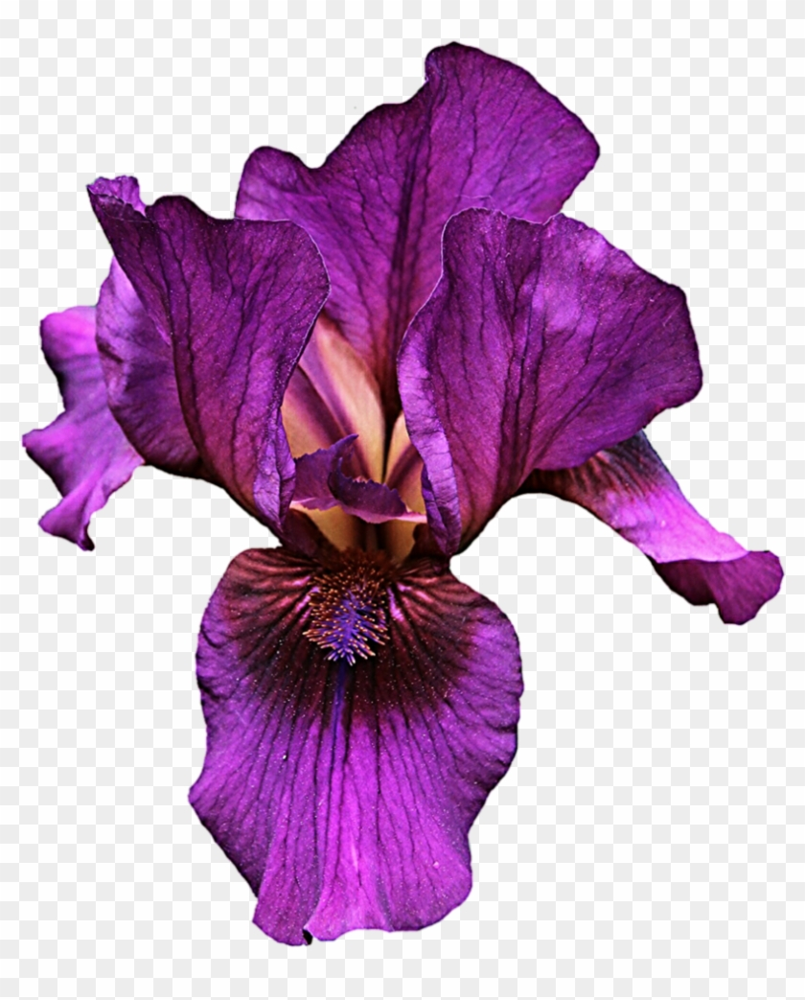

# flower_classification

 
  

<h1 align="center"> Iris Flower Classification </h1>
<h3 align="center"> CAP 4630 - Intro To Artificial Intelligence </h3>
<h5 align="center"> Assignment 4 - <a href="https://www.fau.edu/">Florida Atlantic University</a> </h5>

<h2>Overview</h2>

A simple assignment from my Introduction to AI course to use machine learning to create a 3-class classifier using the Fisher's Iris dataset.

Starter code was provided but what I developed myself has been commented out.

<h2>Project Files Description</h2>

This Project includes 1 executable files:

<h4>Executable Files:</h4>
<ul>
  <li><b>a4py</b> - Includes all of the code for the search algothrims.</li>
 </ul>
 
<h2> Refrences</h2>
<ul>
  <li>
Starter Code provided by professor.

      
Available: N/A

  </li>
  <li>
Notes and Lectures from the course.

      
Available: N/A

  </li>

</ul>
